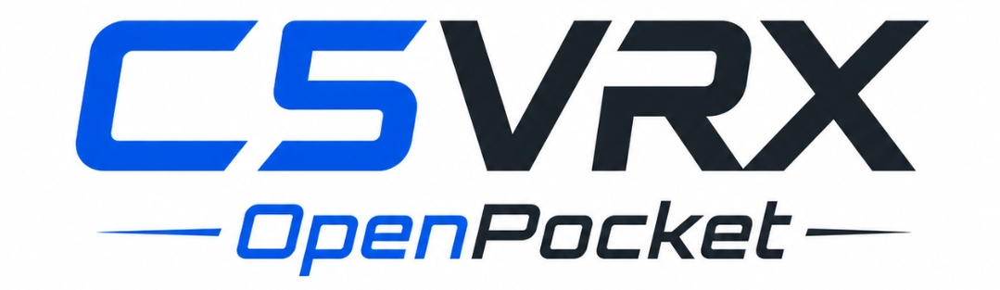

<div align="center">



**Two-ESP32 digital analog-FPV handheld experiment**

An OpenPocket-focused integration of **C5VRX** and **RivetTX**: use an ESP32-C5 as the experimental 5.8 GHz analog FPV receiver/demodulator and the **exact Waveshare ESP32-S3-LCD-Driver-Board with its 40-pin RGB connector** as the OpenPocket mainboard, running **RivetTX as the transmitter firmware** plus the digital FPV display pipeline.


</div>

---

## What is this?

[C5VRX](https://github.com/Twotoz/C5VRX) asks whether the ESP32-C5's 5 GHz Wi-Fi RF chain can be pushed far enough outside its intended job to receive analog 5.8 GHz FPV video.

This repository asks the next question:

> **If C5VRX can continuously recover composite video, can the exact Waveshare ESP32-S3-LCD-Driver-Board turn that stream into a complete OpenPocket transmitter using its onboard 40-pin RGB LCD connector and battery charger, with RivetTX as the main radio firmware and a converted ExpressLRS receiver used as the TX module?**

The target hardware is intentionally tiny:

```text
                 5.8 GHz analog FPV
                         |
                         v
                 +---------------+
                 |   ESP32-C5    |
                 | RF / I,Q      |
                 | WBFM demod    |
                 | CVBS samples  |
                 | raw gimbal ADC|
                 +-------+-------+
                         |
                   QSPI / GDMA
                         |
                         v
          +--------------------------------+
          | Waveshare ESP32-S3-LCD-Driver |
          | Board, N8R8, 40-pin RGB        |
          |                                |
          | RivetTX = main firmware        |
          | PAL/NTSC decode                |
          | RGB framebuffer / LCD          |
          | control / mixer / safety       |
          | ETA6096 1S charge/power        |
          +----------+---------------------+
                     |
                GPIO43/44 CRSF
                     |
                     v
              +---------------------+
              | ELRS RX flashed TX  |
              | e.g. 100 mW PA      |
              +----------+----------+
                         |
                      2.4 GHz
                         |
                      aircraft
```

The **C5 and S3 are the two main processors**. The converted ELRS receiver is a small external RF module. RivetTX remains the radio/control software owner on the S3; this repository supplies the hardware/video integration around it.

---

## Exact S3 board target

This repo does **not** target a generic S3 LCD board.

Target: **Waveshare ESP32-S3-LCD-Driver-Board (SKU 27686)** with:

- ESP32-S3-WROOM-1-N8R8
- 8 MB PSRAM
- 8 MB flash
- onboard USB-C
- ETA6096 1-cell lithium charge/discharge manager
- MX1.25 battery connector
- TCA9554 GPIO expander
- onboard **40-pin 3SPI + RGB connector**

Waveshare's official RGB examples currently use 480x480 ST7701 panels. A different 800x480/480x800 panel is possible only if its electrical pinout and timings match the 40-pin interface or an adapter is used.

See [`docs/waveshare-40pin-target.md`](docs/waveshare-40pin-target.md) for the exact schematic pin map.

---

## Why split C5 and S3?

### ESP32-C5 — RF/video front end + raw input acquisition

```text
5.8 GHz RF
   -> complex I/Q
   -> WBFM discriminator
   -> filtering / decimation
   -> sampled composite video
```

The exact Waveshare S3 board spends most of its native GPIO on RGB. To avoid adding another ADC MCU, the prototype also plans to sample the four analog gimbal axes on the C5 and send timestamped raw snapshots beside the video stream.

The C5 does **not** own radio calibration, mixing or safety. Those raw values enter RivetTX on the S3, which remains responsible for calibration/filtering, stale-input detection, channel generation and failsafe behavior.

### Waveshare ESP32-S3 — OpenPocket main processor

The S3 runs **RivetTX as the main firmware** and adds the digital-FPV hardware services needed by this product:

- RivetTX control/mixing/safety
- PAL/NTSC sync detection
- active-line extraction
- luma first, color later
- scaling/cropping into the framebuffer
- 40-pin RGB LCD timing/output
- C5 raw-input adapter when used
- CRSF on GPIO43/44 to the ELRS RX-as-TX module
- telemetry and warnings
- battery/UI services

The local `firmware/s3` application in this repo is only a **bring-up harness** for the Waveshare board, C5 transport, LCD and decoder. It is not intended to become a second radio firmware.

---

## Exact-board C5 -> S3 video link

The chips do **not** exchange RGB frames. The preferred contract remains sampled CVBS:

```text
C5                         S3
---                        ---
WBFM                       QSPI RX
 |                          |
filter                      DMA ring
 |                          |
8-bit CVBS  ===============> sync / video decode
                             |
                             RGB framebuffer
                             |
                       40-pin RGB LCD
```

The generic idea of "six arbitrary QSPI pins" does not work on this board because the 40-pin LCD consumes most GPIO. The current **candidate runtime mapping** deliberately reuses pins after LCD initialization:

| Signal | S3 GPIO | Note |
|---|---:|---|
| QSPI SCLK | 6 | free in 40-pin RGB mode |
| QSPI CS | 16 | touch INT; touch held reset |
| QSPI IO0 | 1 | reused LCD init SDA |
| QSPI IO1 | 2 | reused LCD init SCK |
| QSPI IO2 | 19 | reused native USB D- |
| QSPI IO3 | 20 | reused native USB D+ |
| CRSF TX/RX | 43 / 44 | ELRS module |
| battery ADC | 4 | onboard divider |

Runtime order:

```text
boot
 -> init TCA9554
 -> hold touch reset
 -> init ST7701/RGB panel on GPIO1/2/42
 -> hold LCD CS high
 -> start RGB engine
 -> disconnect/avoid native USB
 -> remap GPIO1/2/6/16/19/20 to QSPI
 -> start RivetTX services / CRSF on GPIO43/44
```

This is clever but **not yet proven at 40 MHz**. The repo treats signal integrity and LCD/touch isolation as explicit bring-up tests rather than assumptions.

Initial transport target:

| Property | Target |
|---|---:|
| sample format | unsigned 8-bit CVBS |
| sample rate | 10 MS/s first, 13.5 MS/s stretch |
| transport | 4-data-line SPI / QSPI |
| C5 role | slave / producer |
| S3 role | master / consumer |
| buffering | DMA ping-pong/ring |
| framing | fixed blocks + protocol header |

At 13.5 MS/s the raw payload is 108 Mbit/s; a 4-bit 40 MHz bus is 160 Mbit/s raw. Real sustained margin must be benchmarked on this exact pin reuse.

See [`docs/video-link.md`](docs/video-link.md).

---

## RivetTX is the OpenPocket firmware

[RivetTX](https://github.com/Twotoz/RivetTX) is the intended **main application on the ESP32-S3**, not merely a library beside another OpenPocket firmware.

RivetTX already supplies the radio side we want to keep centralized:

- deterministic input, mixer and safety path
- CRSF TX/RX
- ExpressLRS parameter discovery/control
- RX-as-TX module support
- telemetry
- model logic/storage
- warnings and UI semantics
- deadline/stale-input protection

C5VRX-OpenPocket therefore adds product-specific services around RivetTX instead of reimplementing those features:

```text
                    RivetTX control core
                       /          \
                      /            \
       raw input adapter            CRSF -> ELRS RX-as-TX
              ^
              |
C5 video/input transport
              |
              +--> PAL/NTSC decoder --> RGB base image
                                        + RivetTX UI overlay
                                        -> 40-pin LCD
```

Current RivetTX OpenPocket presentation uses an analog AT7456E-compatible OSD. This project needs a new **digital RGB framebuffer presentation backend** so the same RivetTX UI state can be composited directly over the decoded FPV image.

On this board the ExpressLRS module remains:

```text
Waveshare S3 GPIO43 / CRSF TX  ---> converted ELRS RX
Waveshare S3 GPIO44 / CRSF RX  <--- converted ELRS TX
GND                              --- GND
regulated supply                 --- VCC
```

The exact receiver target and its own `hardware.json` define whether 100 mW is actually valid.

See [`docs/rivettx-integration.md`](docs/rivettx-integration.md) for the firmware ownership and integration plan.

---

## What hardware disappears?

If C5VRX succeeds, this route needs no conventional analog display chain:

- no RX5808 / RTC6715 VRX
- no AT7456E / MAX7456 OSD
- no composite LCD controller
- no separate framebuffer IC
- no separate main radio MCU beyond the S3
- no separate charger board for the prototype

Prototype hardware becomes roughly:

```text
ESP32-C5 board
Waveshare ESP32-S3-LCD-Driver-Board
40-pin RGB LCD
ELRS receiver flashed RX-as-TX
2 gimbals + switches
1S battery
2.4 GHz + 5.8 GHz antennas
```

---

## Current status

> **Experimental — not yet a working FPV receiver or flight transmitter.**

The make-or-break research item remains continuous C5 RF sampling. C5VRX has identified a finite vendor complex-I/Q dump path, but continuous wide live I/Q is still unproven.

The exact Waveshare S3 side can be developed independently with generated/recorded PAL/NTSC data while preserving RivetTX as the final firmware target.

| Subsystem | Status |
|---|---|
| exact Waveshare N8R8 40-pin target | 🟢 locked/documented |
| RivetTX as S3 main firmware | 🟢 architecture decision |
| exact schematic pin map | 🟢 encoded in firmware header/docs |
| finite C5 complex-I/Q capture path | 🟡 hardware validation required |
| continuous C5 I/Q | 🔴 blocker / unproven |
| C5 WBFM -> sampled CVBS | 🟡 architecture/model work |
| exact-board QSPI pin reuse | 🟡 designed; hardware benchmark required |
| S3 grayscale PAL/NTSC decode | 🟡 implementation target |
| S3 color decode | ⚪ later milestone |
| 40-pin RGB LCD output | 🟡 official board support exists; fork driver pending |
| RivetTX digital RGB backend | 🔴 new backend required |
| C5 raw-input -> RivetTX adapter | 🔴 new backend required if C5 samples gimbals |
| ELRS RX-as-TX over CRSF | 🟢 upstream architecture; real-HW validation required |

---

## Development plan

### S3 / exact board + RivetTX

1. Build upstream RivetTX for ESP32-S3 unchanged and preserve its control/CRSF behavior.
2. Bring up the Waveshare 40-pin ST7701 RGB example in the local test harness.
3. Reimplement only the needed board initialization/timing as reusable components.
4. Prove framebuffer output while RivetTX-style tasks are running.
5. Hold touch reset and prove GPIO16 is safe to reuse.
6. Initialize panel, hold GPIO42 CS high, then reuse GPIO1/2 without disturbing display.
7. Prove GPIO19/20 transport use with USB disconnected.
8. Run PRBS/counter transport from 10 MHz upward toward 40 MHz.
9. Feed synthetic CVBS and render grayscale.
10. Add a generic RivetTX digital RGB presentation backend and compose UI over video.
11. Add the C5 raw-input adapter if the C5 acquires gimbals.
12. Stress saturated video while checking RivetTX control deadlines and CRSF.

### C5

1. Validate real 5.8 GHz finite I/Q.
2. Recover continuous sample production.
3. Benchmark WBFM.
4. Produce stable sampled CVBS.
5. Add timestamped raw gimbal snapshots if required by the final pin budget.
6. Connect live C5 output to the exact Waveshare/RivetTX target.

See [`docs/bringup.md`](docs/bringup.md), [`docs/hardware.md`](docs/hardware.md), [`docs/rivettx-integration.md`](docs/rivettx-integration.md), and [`docs/waveshare-40pin-target.md`](docs/waveshare-40pin-target.md).

---

## Repository layout

```text
C5VRX-OpenPocket/
├── firmware/
│   ├── c5/
│   └── s3/                 # bring-up harness, not a second radio firmware
│       └── main/
│           └── board_waveshare_s3_lcd_driver.h
├── protocol/
├── docs/
│   ├── architecture.md
│   ├── video-link.md
│   ├── hardware.md
│   ├── rivettx-integration.md
│   ├── waveshare-40pin-target.md
│   └── bringup.md
└── README.md
```

Upstream projects:

- **C5VRX:** <https://github.com/Twotoz/C5VRX>
- **RivetTX:** <https://github.com/Twotoz/RivetTX>

Research useful to every C5VRX target belongs upstream in C5VRX. Generic transmitter/control improvements belong in RivetTX. Exact Waveshare 40-pin + C5 digital-video integration belongs here.

---

## Safety / validation boundary

Do not fly from a development build because the LCD and sticks appear responsive. Real hardware still needs measured control deadlines, failsafe behavior, CRSF integrity, RF verification, video-buffer fault handling, thermals and power testing.
